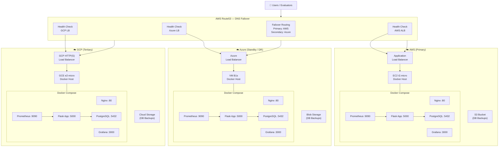
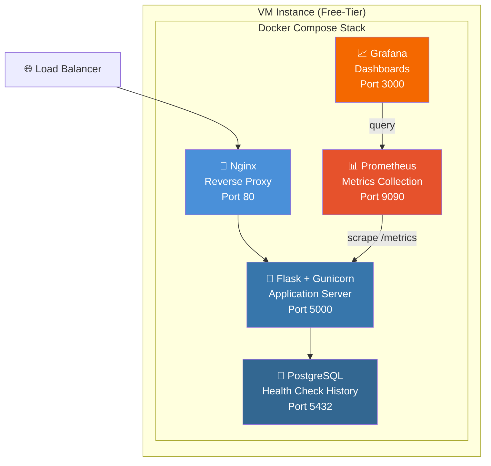
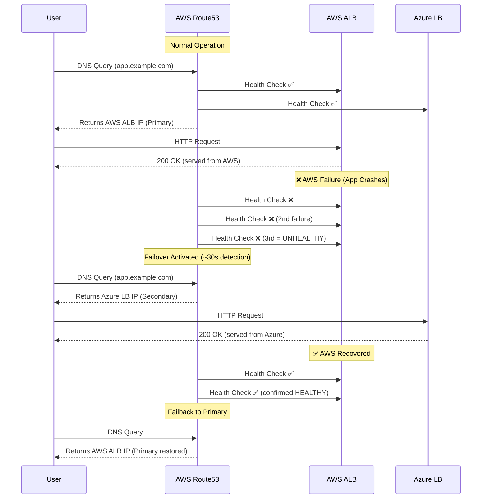
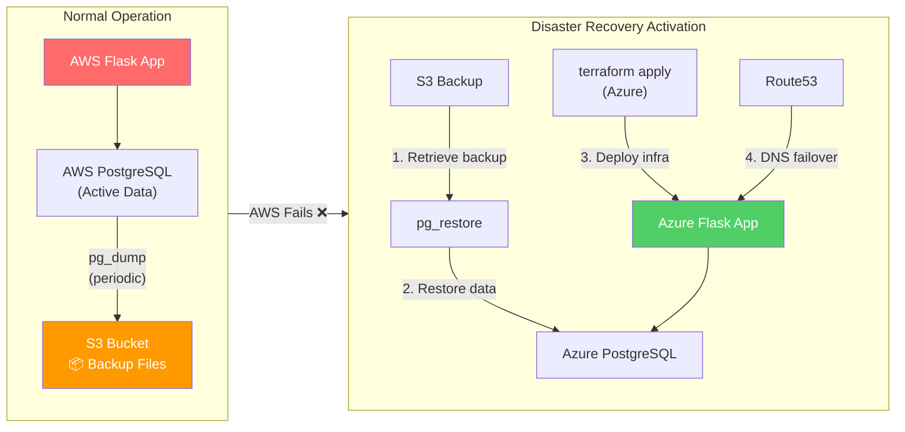
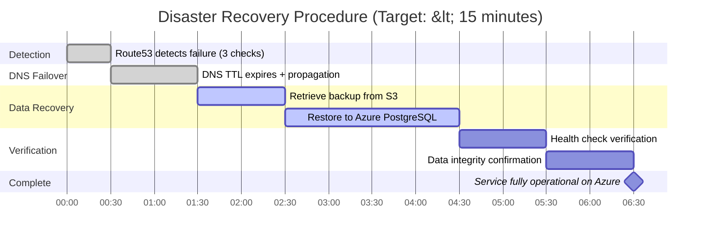
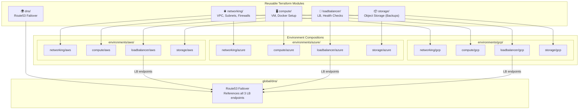
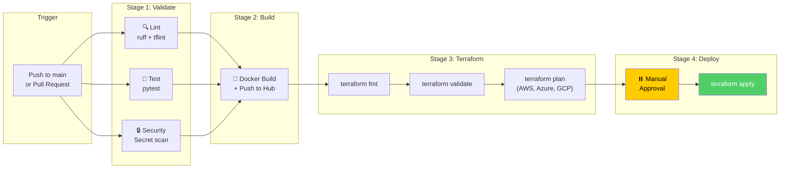

<<<<<<< HEAD
# Multi-Cloud Resource Health Monitor

A Terraform-based multi-cloud deployment system with automated failover, disaster recovery, and infrastructure monitoring — deployed across AWS, Azure, and GCP.

---

## Project Overview

This project demonstrates multi-cloud deployment and management using Terraform. A lightweight web application (Health Monitor) is deployed identically across three cloud providers, with DNS-based failover, load balancing, disaster recovery, and observability built into the infrastructure layer.

The Health Monitor application serves as the workload that proves the infrastructure works — showing real-time health status of all cloud deployments and recording operational history.

### What This Project Delivers

| Layer | Deliverable |
|-------|-------------|
| **Infrastructure** | Terraform modules deploying to AWS, Azure, and GCP |
| **Load Balancing** | Per-cloud load balancers (ALB, Azure LB, GCP LB) |
| **Failover** | Route53 DNS health checks with automatic failover |
| **Disaster Recovery** | Database backup/restore across clouds (< 15 min RTO) |
| **Monitoring** | Prometheus + Grafana per cloud |
| **CI/CD** | GitHub Actions (lint, test, build, Terraform validate) |
| **Application** | Flask-based health monitor dashboard |

---

## Architecture

### High-Level System Architecture

> **Note:** Diagrams below use [Mermaid](https://mermaid.js.org/) syntax. They render automatically on GitHub. To view locally, use VS Code with the "Markdown Preview Mermaid Support" extension, or paste into [mermaid.live](https://mermaid.live) to export as PNG/SVG.



### Per-Cloud Deployment Stack



### Application Endpoints

| Endpoint | Purpose | Used By |
|----------|---------|---------|
| `GET /` | Dashboard (HTML) | Browser / User |
| `GET /health` | Health check (JSON) | Load Balancer, Route53 |
| `GET /metrics` | Prometheus metrics | Prometheus |
| `GET /api/checks` | Health history (JSON) | Dashboard auto-refresh |
| `GET /api/status` | Multi-cloud status | Dashboard |

### DNS Failover Flow



### Disaster Recovery Flow



### DR Timeline



---

### Terraform Module Architecture



### CI/CD Pipeline



---

## Features

### Application Features

| Feature | Description |
|---------|-------------|
| Health Dashboard | Web page showing deployment status across all 3 clouds |
| Health Endpoint | `/health` — JSON response for load balancer integration |
| Multi-Cloud Status | Checks and displays health of AWS, Azure, and GCP endpoints |
| Health History | Records all health checks in PostgreSQL (proves DR data recovery) |
| Cloud Identity | Shows which cloud/region is currently serving the request |
| Metrics Endpoint | `/metrics` — Prometheus-compatible metrics for monitoring |
| Auto-Refresh | Dashboard updates automatically every 30 seconds |

### Infrastructure Features

| Feature | Description |
|---------|-------------|
| Multi-Cloud Terraform | Reusable modules deploy to AWS, Azure, and GCP |
| Load Balancing | Per-cloud load balancer (ALB, Azure LB, GCP LB) |
| DNS Failover | Route53 health checks with automatic routing |
| Disaster Recovery | pg_dump/pg_restore across clouds (< 15 min RTO) |
| Monitoring | Prometheus + Grafana per cloud (fault-isolated) |
| CI/CD | GitHub Actions: lint, test, build, Terraform validate |
| Zero-Cost Teardown | `terraform destroy` removes everything |

---

## Technology Stack

| Component | Technology | Justification |
|-----------|-----------|---------------|
| IaC | Terraform (HCL) | Multi-cloud native; project requirement |
| Application | Python + Flask | Simple; team familiarity; production-proven |
| Frontend | Jinja2 templates + vanilla JS | No build toolchain; server-rendered |
| Database | PostgreSQL 15 (containerized) | Portable; pg_dump enables cross-cloud DR |
| Web Server | Nginx + Gunicorn | Industry standard production pattern |
| Monitoring | Prometheus + Grafana | Open-source; cloud-agnostic |
| DNS | AWS Route53 | Health checks + failover routing |
| CI/CD | GitHub Actions | Integrated; free tier; team choice |
| Containers | Docker + Docker Compose | Portable; identical everywhere |
| Registry | Docker Hub (public) | Accessible from all clouds; free |

### Cloud Resources (Per Provider)

| Resource | AWS | Azure | GCP |
|----------|-----|-------|-----|
| Compute | EC2 t2.micro | VM B1s | GCE e2-micro |
| Network | VPC + Subnet | VNet + Subnet | VPC + Subnet |
| Load Balancer | ALB | Standard LB | HTTP(S) LB |
| Storage | S3 (backups) | Blob Storage | Cloud Storage |
| Firewall | Security Group | NSG | Firewall Rules |
| Free Tier | 12-month eligible | 750h B1s/month | Always free e2-micro |

---

## Project Structure

```
Multi-Cloud_Resource_Health_Monitor/
│
├── README.md                          ← You are here
├── AGENTS.md                          # AI engineering framework rules
├── METADATA.md                        # Project metadata
│
├── 01-context/                        # Business context
│   └── context-pack.md
│
├── 02-requirements/                   # Requirements & scope
│   ├── requirements-specification.md
│   └── mvp-scope.md
│
├── 03-governance/                     # Risk & governance
│   └── risk-register.md
│
├── 04-architecture/                   # Architecture & decisions
│   ├── architecture-blueprint.md
│   └── adr/
│       ├── ADR-001-application-framework.md
│       ├── ADR-002-deployment-model.md
│       ├── ADR-003-dns-failover.md
│       ├── ADR-004-dr-strategy.md
│       ├── ADR-005-monitoring-topology.md
│       ├── ADR-006-container-registry.md
│       └── ADR-007-terraform-state.md
│
├── 05-engineering/                    # Implementation
│   ├── app/                           # Flask application
│   ├── terraform/
│   │   ├── modules/                   # Reusable Terraform modules
│   │   │   ├── networking/            #   VPC/VNet per cloud
│   │   │   ├── compute/              #   VM + Docker per cloud
│   │   │   ├── loadbalancer/         #   LB per cloud
│   │   │   ├── storage/              #   Object storage per cloud
│   │   │   └── dns/                  #   Route53 failover
│   │   ├── environments/             # Per-cloud root configs
│   │   │   ├── aws/
│   │   │   ├── azure/
│   │   │   └── gcp/
│   │   └── global/                   # Cross-cloud (DNS)
│   ├── docker/                        # Dockerfiles, compose
│   └── ci-cd/                         # GitHub Actions workflows
│
├── 06-validation/                     # Test evidence
│   └── validation-strategy.md
│
├── 07-operations/                     # Operational docs
│   ├── runbooks/
│   ├── monitoring/
│   └── dr-procedures/
│
└── 08-intelligence/                   # Lessons learned
    ├── lessons-learned/
    └── reusable-patterns/
```

---

## Sprint Plan (6 Sprints x 20 Hours)

| Sprint | Focus | Key Deliverable |
|--------|-------|-----------------|
| **Sprint 1** | Foundation + App | Working local stack (`docker-compose up`) |
| **Sprint 2** | AWS Deployment | App on AWS via Terraform + ALB + CI/CD |
| **Sprint 3** | Azure + GCP | App deployed on all 3 clouds via Terraform |
| **Sprint 4** | DNS Failover + DR | Route53 failover working + DR tested |
| **Sprint 5** | Monitoring + Hardening | Full monitoring stack + security + integration tests |
| **Sprint 6** | Documentation + Demo | DR rehearsed 3x + all docs + presentation |

### Effort Allocation

```
Infrastructure (Terraform, LB, DNS, DR):  50%  ████████████████████
Application (Flask, DB, templates):       20%  ████████
Monitoring (Prometheus, Grafana):         15%  ██████
CI/CD + Documentation:                   15%  ██████
```

---

## Team Roles (Suggested)

| Role | Responsibilities | Sprints |
|------|-----------------|---------|
| **Infra Lead** | Terraform modules, networking, LB, compute per cloud | 2, 3, 4 |
| **DevOps Lead** | Docker, CI/CD, monitoring, deployment automation | 1, 2, 5 |
| **Python Dev** | Flask app, DB schema, health checking logic | 1, 4 |
| **DBA / DR Lead** | PostgreSQL, backup/restore scripts, DR procedures | 1, 4, 6 |
| **Documentation** | README, deployment guides, ADRs, presentation | All (ongoing) |

---

## Quick Start (Local Development)

```bash
# Prerequisites: Docker + Docker Compose installed

# Clone the repository
git clone https://github.com/tb-repo/multi-cloud-health-monitor.git
cd multi-cloud-health-monitor/05-engineering

# Start the full stack locally
docker-compose up -d

# Access the application
# Dashboard:   http://localhost
# Health:      http://localhost/health
# Metrics:     http://localhost/metrics
# Prometheus:  http://localhost:9090
# Grafana:     http://localhost:3000 (admin/admin)

# Stop everything
docker-compose down
```

---

## Key Architecture Decisions

| # | Decision | Rationale |
|---|----------|-----------|
| 1 | Flask (not React/FastAPI) | Team has Python scripting experience; server-rendered HTML eliminates frontend complexity |
| 2 | Single VM + Docker Compose per cloud | Free-tier eligible; portable; simple; same pattern everywhere |
| 3 | Route53 for DNS failover | Native health checks + failover routing; automated; ~$2/month |
| 4 | Backup/Restore DR (not replication) | Simple; cross-cloud compatible; pg_dump is universal |
| 5 | Monitoring per cloud (distributed) | Fault-isolated; one cloud down doesn't kill monitoring on others |
| 6 | Docker Hub (public) | Accessible from all clouds without auth; free; no competitive risk |
| 7 | Separate Terraform state per cloud | Safe; isolated; team can work in parallel |

---

## Evaluation Alignment

| Criterion | Weight | How We Satisfy |
|-----------|--------|----------------|
| **Implementation** | 75% | Terraform multi-cloud + LB + failover + DR + monitoring + working app on 3 clouds |
| **Documentation** | 15% | Context Pack, Architecture, ADRs, Deployment Guides, DR Runbook, README |
| **Cost Optimization** | 10% | Free-tier design; zero-cost teardown; cost decisions documented; Grafana visibility |

---

## Capstone Requirements Mapping

| Original Requirement | How We Satisfy |
|---------------------|----------------|
| "Deploy resources across AWS, Azure, and GCP" | Terraform deploys identical stack to all 3 clouds |
| "Automate infrastructure with Terraform modules" | Modular Terraform: networking, compute, LB, storage, DNS |
| "Load balancing and failover mechanisms" | Per-cloud LB + Route53 DNS health check failover |
| "Disaster recovery with data replication" | pg_dump/pg_restore across clouds; demonstrated failover |
| "Monitoring and alerts for resource usage" | Prometheus + Grafana per cloud; health dashboard |

---

## License

Academic project — Hero Vired Capstone.

---

*Built using the AI Assisted Engineering Framework v1.0*
=======
# multi-cloud-health-monitor
A lightweight, cloud-agnostic web application deployed across AWS, Azure, and GCP that provides real-time visibility into multi-cloud deployment health, demonstrates automated failover, and serves as the workload for a Terraform-based multi-cloud infrastructure system.
>>>>>>> cad5573704e789558958fe899ac1b36311bd575a
